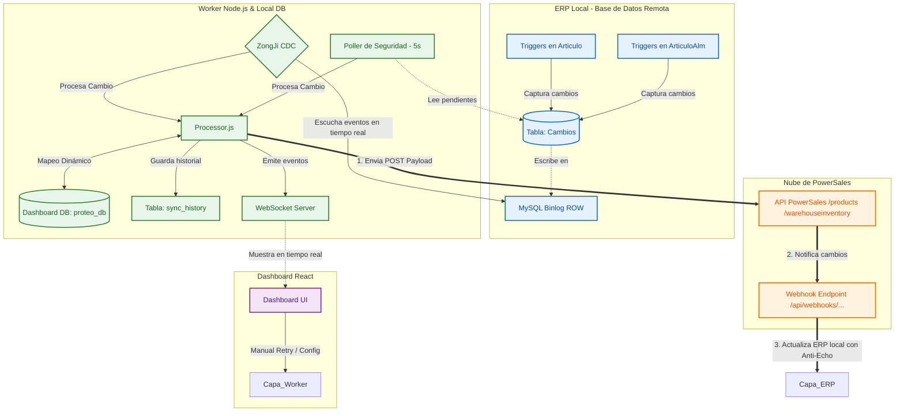
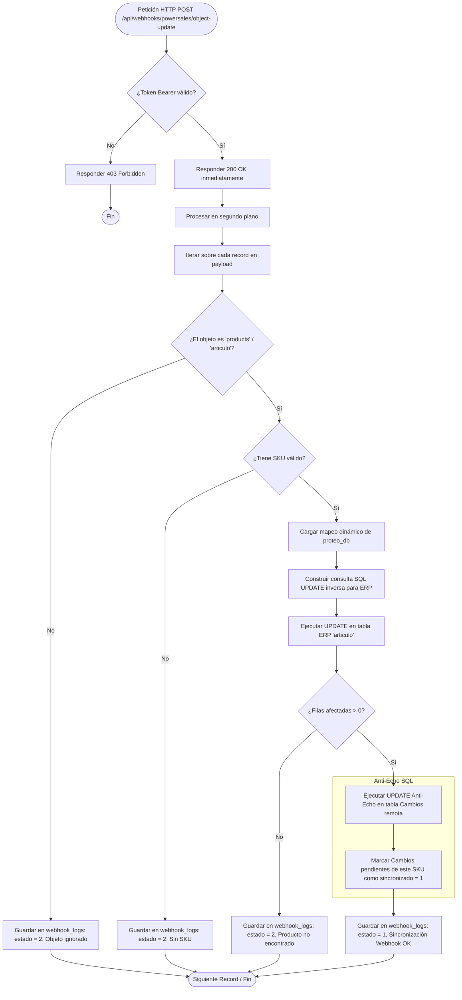

# Documentación Técnica del Sistema de Sincronización (Proteo)

Esta documentación describe la arquitectura y el funcionamiento detallado del sistema **Proteo / PowerSales Sync**, diseñado para la sincronización robusta en tiempo real entre el **ERP local (MySQL)** y la **API de PowerSales**.

---

## 📌 Arquitectura General del Sistema

El sistema utiliza una arquitectura orientada a eventos basada en **CDC (Change Data Capture)** y un **Poller de seguridad** como fallback. Consta de tres capas principales:

1. **Capa ERP / Base de Datos (Nivel MySQL Remoto/Local):** Disparadores (Triggers) capturan cambios en el ERP e insertan registros en la tabla remota `Cambios`.
2. **Worker CDC & REST API (Servicios Backend Node.js):**
   - Escucha en tiempo real los cambios del base de datos mediante el registro de binarios (*binlog*).
   - Poller periódico de seguridad.
   - Motor de mapeo dinámico basado en configuración almacenada en `proteo_db` (Base de datos local del dashboard).
   - Servidor HTTP/Express y WebSocket.
3. **Dashboard Administrativo (Frontend React + Vite):** Panel visual para monitorear estados, reintentar errores, modificar mapeos dinámicos de campos y pausar/reanudar el worker.



---

## 🔄 1. Flujo de Sincronización de Salida (ERP ➔ PowerSales)

Este flujo se ejecuta cuando un usuario o sistema ERP realiza una modificación en artículos o existencias.

### Detalle del Flujo de Sincronización
1. **Trigger ERP:** El ERP realiza operaciones de inserción o actualización. Un trigger en la base de datos escribe una fila en `Cambios` con `sincronizado = 0` (pendiente).
2. **Detección (Dual-Path):**
   - **Binlog (CDC):** La librería `ZongJi` lee la transacción desde el binlog de MySQL en tiempo real, captura el evento de inserción y llama a `processChange(id)`.
   - **Poller (Fallback):** Cada 5 segundos, un intervalo lee de la BD los registros con `sincronizado = 0` para asegurar que ningún registro quede colgado.
3. **Mapeo:** El processor lee el cambio del ERP, extrae los mapeos dinámicos guardados en la tabla local `field_mapping` y construye el JSON (Payload) final compatible con PowerSales.
4. **Envío con Reintentos:** Se envía a la API de PowerSales. Si falla, el worker reintenta recursivamente con un retraso exponencial (Backoff) hasta alcanzar el máximo de reintentos configurado.
5. **Finalización:** 
   - Si la sincronización es **correcta**, se guarda en el historial local (`sync_history` con `estado = 1`), se marca en el ERP (`sincronizado = 1`), y se transmite el evento `sync_ok` mediante WebSockets.
   - Si **falla** tras todos los intentos, se guarda localmente (`sync_history` con `estado = 2` y descripción del error), se marca en el ERP (`sincronizado = 2`), y se transmite `sync_error`.

### Diagrama de Flujo: Sincronización ERP a PowerSales

```mermaid
flowchart TD
    Start([Cambio detectado en base de datos ERP]) --> CheckMode{¿Cómo se detectó?}
    
    %% Ruta CDC
    CheckMode -->|Binlog CDC| CDCPath[ZongJi intercepta INSERT en tabla Cambios]
    CDCPath --> GetID[Extraer ID de cambio]
    
    %% Ruta Poller
    CheckMode -->|Poller Fallback| PollPath[Consulta periódica cada 5s en tabla Cambios]
    PollPath --> HasPending{¿Hay pendientes con sincronizado = 0?}
    HasPending -->|No| EndPoller([Fin ciclo Poller])
    HasPending -->|Sí| LimitRows[Tomar lote de hasta 10 registros]
    LimitRows --> GetID
    
    GetID --> CheckPause{¿Worker pausado?}
    CheckPause -->|Sí| SkipChange[Omitir procesamiento]
    CheckPause -->|No| ReadERP[Leer registro completo desde el ERP]
    
    ReadERP --> CheckActive{¿Tabla / Entidad activa en Config?}
    CheckActive -->|No| MarkSkip[Marcar sincronizado = 1 en ERP y omitir]
    CheckActive -->|Sí| LoadMapping[Cargar reglas de mapeo dinámico de proteo_db]
    
    LoadMapping --> BuildPayload[Construir JSON Payload compatible con PowerSales]
    BuildPayload --> PSRequest[Enviar HTTP POST a API PowerSales]
    
    PSRequest --> PSResponse{¿Respuesta HTTP OK (2xx)?}
    
    %% Ruta OK
    PSResponse -->|Sí| SaveOK[Guardar en sync_history local con estado = 1]
    SaveOK --> MarkSynced[Actualizar Cambios en ERP: sincronizado = 1, fecha_sync = NOW]
    MarkSynced --> WS_OK[Emitir 'sync_ok' por WebSocket]
    WS_OK --> SuccessEnd([Sincronización Exitosa])
    
    %% Ruta Error / Reintentos
    PSResponse -->|No / Exception| IncrementAttempt[Incrementar intentos de envío]
    IncrementAttempt --> CheckMax{¿Supera max_retries configurado?}
    
    CheckMax -->|No| Backoff[Calcular tiempo de espera: backoff * intento]
    Backoff --> Sleep[Esperar N milisegundos]
    Sleep --> PSRequest
    
    CheckMax -->|Sí| SaveErr[Guardar en sync_history local con estado = 2 y mensaje de error]
    SaveErr --> MarkError[Actualizar Cambios en ERP: sincronizado = 2, error_sync = msg]
    MarkError --> WS_Err[Emitir 'sync_error' por WebSocket]
    WS_Err --> ErrorEnd([Sincronización Fallida / Registrada])
```

---

## 📥 2. Flujo de Entrada (Webhooks de PowerSales ➔ ERP Local)

Este flujo representa cómo viajan las actualizaciones hechas en la nube de PowerSales de regreso a nuestra base de datos ERP local, implementando autenticación y seguridad contra ciclos infinitos (*Anti-Echo*).

### Detalle del Flujo de Entrada
1. **Petición del Webhook:** PowerSales envía un webhook HTTP POST con el objeto modificado al endpoint `/api/webhooks/powersales/object-update`.
2. **Respuesta Rápida (200 OK):** El servidor Express responde inmediatamente con HTTP `200 OK` para liberar la conexión de PowerSales y evitar bloqueos por latencia, procesando el cambio de forma asíncrona (en segundo plano).
3. **Mapeo Inverso:** Lee la configuración del mapeo inverso guardada en `field_mapping` para transformar las llaves del JSON de PowerSales (ej. `Name`, `Cost`, `IsActive`) a las columnas exactas del ERP (ej. `Descripcion`, `Costo_Ult_Compra`, `Habilitado`).
4. **Mecanismo Anti-Echo:** Al actualizar localmente las columnas correspondientes en el ERP, se dispara de forma automática una sentencia SQL de actualización en la tabla remota `Cambios`:
   ```sql
   UPDATE Cambios 
   SET sincronizado = 1, fecha_sync = NOW() 
   WHERE tabla = 'articulo' AND clave_registro = ? AND sincronizado = 0
   ```
   **¿Por qué es crítico?** Esto previene un ciclo de eco infinito. Al marcar cualquier registro pendiente como sincronizado (`sincronizado = 1`), el Worker CDC ignorará la actualización local que acabamos de hacer mediante el webhook, rompiendo el bucle.
5. **Auditoría:** Se guarda un registro de todo webhook recibido con su estado final de aplicación en la tabla local `webhook_logs`.

### Diagrama de Flujo: Webhook y Anti-Echo



---

## 🗄️ Esquema de Base de Datos Local (`proteo_db`)

El panel de administración local utiliza una base de datos MySQL dedicada (`proteo_db`) para aislar los datos del sistema de sincronización y no afectar la base de datos principal de producción del ERP.

| Tabla | Propósito | Columnas Clave |
|---|---|---|
| **`app_config`** | Configuración caliente del Worker. | `key`, `config_value`, `updated_at` |
| **`field_mapping`** | Mapeo dinámico de campos ERP a campos PowerSales. | `entity`, `ps_field`, `erp_column`, `fixed_value` |
| **`sync_history`** | Historial detallado de todas las sincronizaciones de salida. | `cambio_id`, `entidad`, `operacion`, `datos` (JSON), `estado` (1=OK, 2=Error), `error_msg`, `intentos`, `fecha_sync` |
| **`webhook_logs`** | Logs de auditoría de todas las peticiones entrantes. | `entidad`, `clave_registro`, `datos` (JSON), `estado`, `error_msg`, `fecha_recepcion` |

---

## 🛠️ Tecnologías y Librerías Utilizadas

- **Express.js (Node.js backend):** Implementación de la API REST que consume el frontend y de los endpoints de webhooks.
- **ZongJi (CDC Engine):** Escucha binaria directa del log de MySQL que reduce a cero el consumo de recursos en comparación con consultas repetitivas a la base de datos.
- **WebSockets (ws):** Comunicación bidireccional y reactiva en tiempo real con el dashboard de React.
- **React 18 + Vite (Frontend):** Dashboard moderno y optimizado con visualizaciones dinámicas de estado, logs, payloads y herramientas de configuración.
- **Axios:** Cliente HTTP para la API de PowerSales y la comunicación interna.
