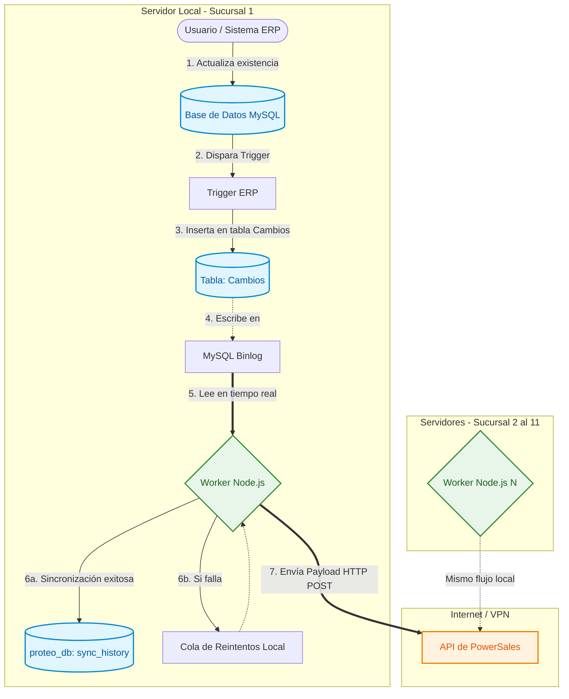

# Flujo de Sincronización (Arquitectura Distribuida)

Este diagrama representa cómo fluye la información desde que haces un cambio en cualquiera de las 11 sucursales hasta que llega a PowerSales, asumiendo el **Enfoque Distribuido** (un worker Node.js corriendo localmente en cada servidor).

### Explicación del Flujo:
1. **Actualización:** Alguien hace una venta o ajuste en el ERP de la Sucursal 1.
2. **Trigger:** El Trigger de la base de datos detecta el cambio.
3. **Tabla de Cambios:** El trigger inserta el registro pendiente en la tabla `Cambios`.
4. **Binlog:** Al mismo tiempo, MySQL registra silenciosamente esta transacción en su archivo de bajo nivel (*Binlog*).
5. **Worker (CDC):** El programa de Node.js (que está instalado ahí mismo) está escuchando el Binlog. Al detectar el cambio, arma el paquete (Payload).
6. **Historial Local:** El resultado (éxito o error) se guarda localmente en el dashboard de esa misma sucursal.
7. **Envío a la Nube:** Finalmente, el Payload viaja por internet directamente a la API de PowerSales.

Como puedes ver, **la parte más crítica y pesada del trabajo (pasos 1 al 6) se hace sin salir del servidor de la sucursal**, garantizando que nunca se pierdan datos aunque se caiga el internet temporalmente.
